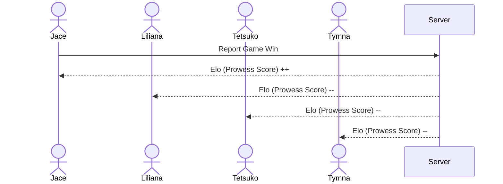

# Prowess

*Tracking Skill in cEDH*

## Specification Deliverable

### Elevator Pitch

cEDH is a way to enjoy a popular card game known as Magic the Gathering (MTG). This style of play involves four people engaging in a complex free-for-all format. This uncommon play dynamic means that performance isn't always accurately measured as "winning and losing". Here at Prowess, we have devised a series of algorithms that accurately track, rank, and quantify skill in this complicated game of strategy and social decite. All you have to do is keep playing as normal, but let us know who won!

### Design

Here is a sequence diagram that shows how people would interact with the backend when reporting game results.

### Key Features

 - Secure login over HTTPS
 - Report winners of your cEDH games
 - Display top-ranking players
 - Update rankings in real time
 - Game results and history are stored
 - Ability for an admin to delete invalid games (stretch goal)
 - Browse players in your local metas

### Technologies

I am going to use the required technologies in the following ways:

 - **HTML** - HTML stuctured correctly for the application. Three HTML pages. One for login, one for submitting games results, and one for viewing rankings. (Could potentially combine pages 2 and 3)
 - **CSS** - Application is viewable without a headache on different-sized devices. Information doesn't feel overwhelming by using correct white space and contrasting colors. Dark mode is life. Red/Green Arrows for showing improvement of scores (stretch goal)
 - **React** - Logins, opponent selection, game result selection, applying new scores to ranking elos, displaying rankings, displaying different rankings based on location preference. 
    - Some selection items become disabled when one is selected.
    - Submit game widget or functionality hidden until logged in
 - **Service** - Backend service with endpoints for:
    - Login
    - Retrieiving list of possible opponents
    - Submitting game results
    - retrieving ranking lists of all players
    - API call to Scryfall for MTG pictures, commanders
 - **DB/Login** - Store users, opponents, game results, opponents-per-game, elo. users will be able to register and login. Credentials will be securely stores on the database. Potential for some sort of verification where a user is alerted that a game has been reported with them in it (stretch goal)
 - **Authentification** - Users cannot submit games without logging in. Logins, sign-ups, 
 - **WebSocket** - When games are submitted, elos update in real time, showing a user if their score went up or down (reflected by a red/green arrow).

 ### HTML Deliverable

 For this deliverable I built out the structure of my application using HTML.

- [x] **HTML pages** - Three HTML page that represent the ability to login, view the leaderboard, and then submit game results. The verify HTML page can be ignored, that is a stretch goal of mine to work on and is not part of the deliverable.
- [x] **Proper use of HTML Tags** - Each page correctly uses BODY, NAV, MAIN, HEADER, FOOTER as necessary.
- [x] **Links** - The login page automatically links to the leaderboard page. Each page contains links to each other page.
- [x] **Text** - The application is explained and each input has proper labels.
- [ ] **Images** - I couldn't figure out how to include an image and so I didn't do this. 😔
- [x] **DB/Login** - Input box and submit button for login. The voting choices represent data pulled from the database.
- [x] **WebSocket** - The count of voting results represent the tally of realtime votes.