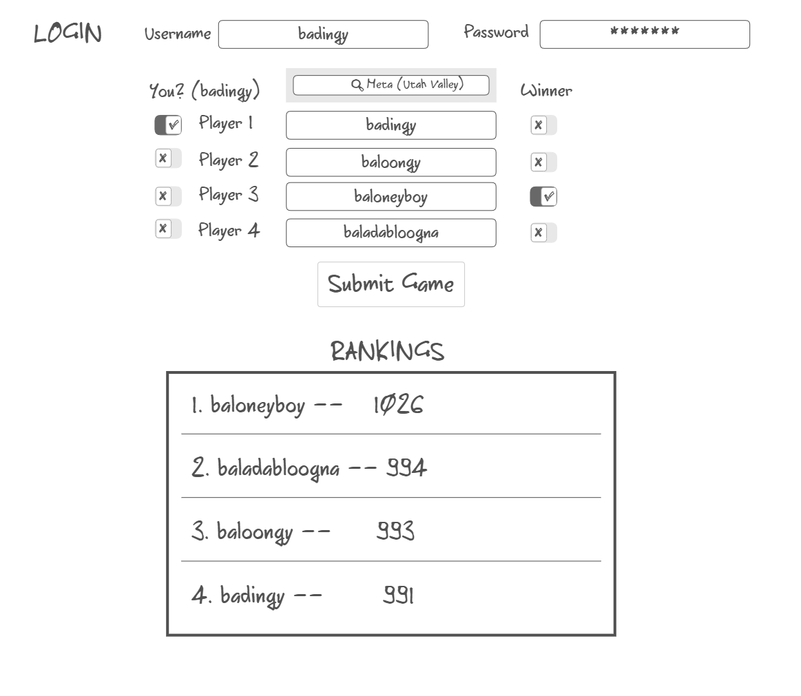

# Prowess

*Tracking Skill in cEDH*

## Specification Deliverable

### Elevator Pitch

cEDH is a way to enjoy a popular card game known as Magic the Gathering (MTG). This style of play involves four people engaging in a complex free-for-all format. This uncommon play dynamic means that performance isn't always accurately measured as "winning and losing". Here at Prowess, we have devised a series of algorithms that accurately track, rank, and quantify skill in this complicated game of strategy and social decite. All you have to do is keep playing as normal, but let us know who won!

### Design

Here is a sequence diagram that shows how people would interact with the backend when reporting game results.

### Key Features

 - Secure login over HTTPS
 - Report winners of your cEDH games
 - Display top-ranking players
 - Update rankings in real time
 - Game results and history are stored
 - Ability for an admin to delete invalid games (stretch goal)
 - Browse players in your local metas

### Technologies

I am going to use the required technologies in the following ways:

 - **HTML** - HTML stuctured correctly for the application. Three HTML pages. One for login, one for submitting games results, and one for viewing rankings. (Could potentially combine pages 2 and 3)
 - **CSS** - Application is viewable without a headache on different-sized devices. Information doesn't feel overwhelming by using correct white space and contrasting colors. Dark mode is life. Red/Green Arrows for showing improvement of scores (stretch goal)
 - **React** - Logins, opponent selection, game result selection, applying new scores to ranking elos, displaying rankings, displaying different rankings based on location preference. 
    - Some selection items become disabled when one is selected.
    - Submit game widget or functionality hidden until logged in
 - **Service** - Backend service with endpoints for:
    - Login
    - Retrieiving list of possible opponents
    - Submitting game results
    - retrieving ranking lists of all players
    - API call to Scryfall for MTG pictures, commanders
 - **DB/Login** - Store users, opponents, game results, opponents-per-game, elo. users will be able to register and login. Credentials will be securely stores on the database. Potential for some sort of verification where a user is alerted that a game has been reported with them in it (stretch goal)
 - **Authentification** - Users cannot submit games without logging in. Logins, sign-ups, 
 - **WebSocket** - When games are submitted, elos update in real time, showing a user if their score went up or down (reflected by a red/green arrow).

 ### HTML Deliverable

 For this deliverable I built out the structure of my application using HTML.

 Pre-reqs
 - [x] **Simon** - deployed successfully
 - [x] **Github Link** - github link at bottom of each html page
 - [x] **Notes** - notes updated, good luck TAs
 - [x] **Commits** - I pushed the Commit Button more than once

Main Reqs
- [x] **HTML pages** - Three HTML page that represent the ability to login, view the leaderboard, and then submit game results. The verify HTML page can be ignored, that is a stretch goal of mine to work on and is not part of the deliverable.
- [x] **Proper use of HTML Tags** - Each page correctly uses BODY, NAV, MAIN, HEADER, FOOTER as necessary.
- [x] **Links** - The login page automatically links to the leaderboard page. Each page contains links to each other page.
- [x] **Text** - The application is explained and each input has proper labels.
- [x] **3rd Party Service Calls** - Under the Submit Page, the final text box is for the user to submit a "commander", typing in this box will ping Scryfall's API and return possible matches for commanders based on what is typed.
- [x] **Images** - One Image Added, the logo
- [x] **Login and Username Display** - Input box and submit button for login and create account. Username is displayed under the Submit page and will automatically fill in when their seat is selected (placeholder)
- [x] **Database data placeholder** - Leaderboard will show content stored in the database, submit page player search bar pulls from the db of registered players.
- [x] **WebSocket data placeholder** - The leaderboard will actively update in real time, showing submissions affecting it to everyone else on the site.

 ### CSS Deliverable

 Pre-reqs

 - [x] **Simon CSS** - deployed successfully
 - [x] **Github Link** - github link at bottom of each html page
 - [x] **Notes** - notes updated, good luck TAs
 - [x] **Commits** - I pushed the Commit Button more than once

 For this deliverable I styled the application into something close to what I think is acceptable. I mostly wanted to test possibilities and will continue to test things. I feel very comfortable with boostrap, but am overwhelmed by the many CSS options.

 - [x] **Headers, Footers, Main** - all have some amount of CSS
 - [x] **Navigation Menu** - Has CSS and is flexible, will hide on window resize too small
 - [x] **Responsive** - Things resize when the window does and on smaller devices.
 - [x] **Application Elements** - Dark mode is Live, things can be read, and white space is acceptable. Ignore the giant photo on the home page, I wanted to see how obnoxious that test-ad would be and was experimenting with borders and containers from the Simon CSS.
- [x] **Application Text Content** - Fonts are basic, default, and consistent. I use bold fonts when needed or apporopriate for titles, headers, otherwise.
 - [x] **Application Images** - Images should resize reactively. Some are part of of a main div or are in a container div with applies CSS like borders, sizing, etc.